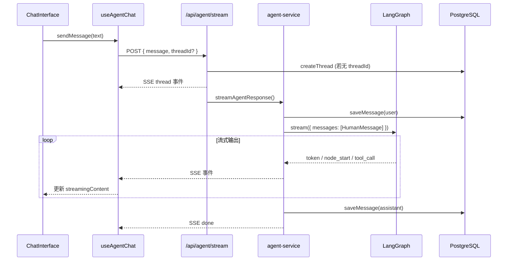
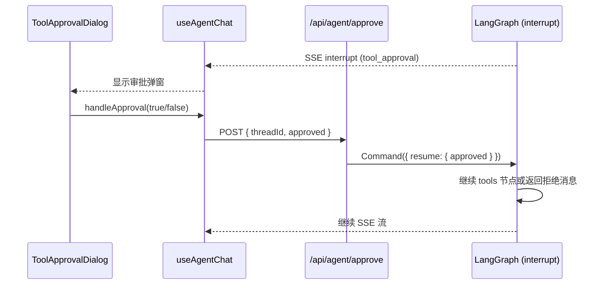

# AI Agent 架构文档

通用 AI 助手，基于 **Next.js 16 + LangGraph + DeepSeek**，支持工具调用、会话持久化、Human-in-the-loop 工具审批。

---

## 目录

1. [系统概览](#系统概览)
2. [架构分层](#架构分层)
3. [核心数据流](#核心数据流)
4. [LangGraph 状态图](#langgraph-状态图)
5. [Human-in-the-loop 审批机制](#human-in-the-loop-审批机制)
6. [数据存储](#数据存储)
7. [API 接口](#api-接口)
8. [SSE 事件协议](#sse-事件协议)
9. [文件说明](#文件说明)

---

## 系统概览

```
┌─────────────────────────────────────────────────────────────────┐
│                         浏览器 (React)                           │
│  ChatInterface → useAgentChat → fetch SSE                      │
└───────────────────────────┬─────────────────────────────────────┘
                            │ HTTP / SSE
┌───────────────────────────▼─────────────────────────────────────┐
│                    Next.js App Router                            │
│  middleware (user_id cookie) → API Routes → Services            │
└───────────────┬─────────────────────────────┬───────────────────┘
                │                             │
    ┌───────────▼──────────┐      ┌───────────▼──────────┐
    │   Prisma + PostgreSQL │      │   LangGraph Agent    │
    │   threads / messages  │      │   DeepSeek + Tools   │
    └───────────────────────┘      │   Postgres Checkpointer │
                                   └───────────────────────┘
```

| 层级 | 技术 | 职责 |
|------|------|------|
| 前端 | React 19 + Tailwind CSS 4 | 聊天 UI、SSE 消费、工具审批弹窗 |
| API | Next.js Route Handlers | REST + SSE 流式接口 |
| 业务 | Services | Agent 流式编排、Thread CRUD |
| Agent | LangGraph.js + LangChain.js | ReAct 循环、工具执行、中断恢复 |
| LLM | DeepSeek API (`deepseek-chat`) | 推理与工具调用决策 |
| 持久化 | PostgreSQL + Prisma | 会话/消息元数据；LangGraph Checkpoint |

---

## 架构分层

项目采用 **四层结构**，职责清晰分离：

```
src/
├── app/              # 路由层：页面 + API Route Handlers
├── components/       # 展示层：React UI 组件
├── hooks/            # 客户端逻辑：SSE 消费、状态管理
├── services/         # 业务层：编排 Agent 与数据库操作
├── lib/              # 基础设施：Agent 图、LLM、DB、Auth
└── types/            # 共享类型定义
```

**依赖方向**（单向）：

```
app → services → lib
components → hooks → (fetch) app/api
```

`lib/agent/` 不依赖 `services/`，Agent 核心逻辑可独立测试与复用。

---

## 核心数据流

### 发送消息



### 工具审批恢复



---

## LangGraph 状态图

Agent 采用经典 **ReAct 循环**（Reason + Act）：

```
        ┌─────────┐
        │  START  │
        └────┬────┘
             │
             ▼
        ┌─────────┐
   ┌───►│  agent  │◄────────────────┐
   │    └────┬────┘                 │
   │         │ shouldContinue       │
   │         ├── 有 tool_calls ──►  │
   │         │                      │
   │         └── 无 tool_calls ──► END
   │                                │
   │    ┌─────────┐                 │
   │    │  tools  │                 │
   │    └────┬────┘                 │
   │         │ shouldRetryTools     │
   │         ├── 待审批 ──► tools   │
   │         └── 已完成 ────────────┘
   │
   └── (interrupt 暂停，等待用户审批)
```

**节点说明：**

| 节点 | 文件 | 行为 |
|------|------|------|
| `agent` | `lib/agent/graph/nodes.ts` | 调用 DeepSeek，绑定工具，生成 AI 回复或 tool_calls |
| `tools` | `lib/agent/graph/nodes.ts` | 检查敏感工具 → `interrupt()` 暂停 → 执行 ToolNode |

**图状态**（`lib/agent/state.ts`）：

- `messages`：LangChain 消息列表，reducer 为 concat
- `approvedToolIds`：已审批通过的 tool_call ID 集合

**Checkpoint**：每个 `thread_id` 对应 LangGraph 的 checkpoint，实现多轮对话上下文恢复。Checkpoint 表由 `PostgresSaver.setup()` 在首次 API 调用时自动创建。

---

## Human-in-the-loop 审批机制

敏感工具定义在 `REQUIRES_APPROVAL` 集合中：

```typescript
// lib/agent/state.ts
export const REQUIRES_APPROVAL = new Set(["write_note", "delete_note"]);
```

**流程：**

1. Agent 决定调用 `write_note` 或 `delete_note`
2. `toolsNode` 检测到该 tool_call 未在 `approvedToolIds` 中
3. 调用 LangGraph `interrupt({ type: "tool_approval", toolCall: {...} })`
4. 图执行暂停，checkpoint 保存中断状态
5. `agent-service` 检测到 `__interrupt__`，向前端发送 `interrupt` SSE 事件
6. 用户点击批准/拒绝 → `POST /api/agent/approve`
7. `graph.stream(new Command({ resume: { approved } }))` 恢复执行
8. 批准：执行工具；拒绝：写入 "用户拒绝了此工具调用" 的 ToolMessage

---

## 数据存储

### 双轨持久化

| 存储 | 用途 | 管理方 |
|------|------|--------|
| Prisma `threads` / `messages` | UI 展示用的会话列表与消息历史 | `thread-service` |
| LangGraph Checkpoint 表 | Agent 完整对话状态（含 tool_calls、ToolMessage） | `PostgresSaver` |

> Prisma 消息是 **展示层快照**（user/assistant 文本）；LangGraph Checkpoint 是 **Agent 运行时状态**（完整消息链）。两者通过相同的 `thread_id` 关联。

### Prisma Schema

```
Thread                          Message
┌──────────────────┐           ┌──────────────────┐
│ id (uuid, PK)    │───1:N────►│ id (uuid, PK)    │
│ user_id          │           │ thread_id (FK)   │
│ title            │           │ role             │
│ created_at       │           │ content (text)   │
│ updated_at       │           │ metadata (json)  │
└──────────────────┘           │ created_at       │
                               └──────────────────┘
```

### 用户身份

无完整登录系统。`middleware.ts` 为每个访客自动分配 `user_id` Cookie（UUID，有效期 1 年），用于隔离不同用户的 Thread。

---

## API 接口

| 方法 | 路径 | 说明 | 响应 |
|------|------|------|------|
| `POST` | `/api/agent/stream` | 发送消息，启动 Agent | SSE 流 |
| `POST` | `/api/agent/approve` | 审批/拒绝工具调用 | SSE 流（恢复执行） |
| `GET` | `/api/threads` | 列出当前用户的会话 | JSON |
| `POST` | `/api/threads` | 创建新会话 | JSON |
| `GET` | `/api/threads/[threadId]` | 获取会话及消息 | JSON |
| `DELETE` | `/api/threads/[threadId]` | 删除会话 | JSON |

所有 Agent 相关 Route 使用 `runtime = "nodejs"`、`maxDuration = 60`（适配 Vercel Serverless）。

---

## SSE 事件协议

前端 `useAgentChat` 通过 `consumeSSE` 解析 `data: {...}\n\n` 格式：

| 事件类型 | 触发时机 | data 字段 |
|----------|----------|-----------|
| `thread` | 新会话创建 | `{ threadId }` |
| `node_start` | LangGraph 节点开始 | `{ node: "agent" \| "tools" }` |
| `node_end` | LangGraph 节点结束 | `{ node }` |
| `token` | Agent 文本流式输出 | `{ content }` |
| `tool_call` | 工具调用 chunk | `{ chunks }` |
| `interrupt` | 需要用户审批 | `{ type, toolCall }` |
| `done` | 本轮完成 | `{}` |
| `error` | 异常 | `{ message }` |

---

## 文件说明

### 根目录配置文件

| 文件 | 说明 |
|------|------|
| `package.json` | 项目依赖与脚本。`dev` 启动开发服务器；`db:push` 同步 Prisma Schema；`build` 含 `prisma generate` |
| `docker-compose.yml` | 本地 PostgreSQL 16 容器，端口映射 `5433:5432`，用户/密码/库名均为 `aiagent` |
| `.env.example` | 环境变量模板：`DEEPSEEK_API_KEY`、`DATABASE_URL`、可选 LangSmith 配置 |
| `.env` | 本地环境变量（不提交 Git） |
| `next.config.ts` | Next.js 配置（当前为空配置） |
| `tsconfig.json` | TypeScript 配置，`@/*` 映射到 `src/*` |
| `prisma.config.ts` | Prisma 7 配置，指定 schema 路径与 datasource URL |
| `postcss.config.mjs` | PostCSS 配置，启用 Tailwind CSS 4 |
| `eslint.config.mjs` | ESLint 配置，继承 `eslint-config-next` |
| `vercel.json` | Vercel 部署配置，指定 build 命令 |
| `next-env.d.ts` | Next.js 自动生成的 TypeScript 类型声明 |
| `README.md` | 项目介绍、快速开始、部署指南 |
| `AGENTS.md` / `CLAUDE.md` | AI 编码助手规则（Next.js 16 注意事项） |

---

### `src/app/` — 路由层

#### 页面

| 文件 | 说明 |
|------|------|
| `app/layout.tsx` | 根布局。加载 Geist 字体、全局 CSS、设置页面 metadata |
| `app/page.tsx` | 首页，直接 `redirect("/chat")` |
| `app/globals.css` | 全局样式。Tailwind CSS 4 导入、CSS 变量、prose 样式 |
| `app/chat/page.tsx` | 新对话页，渲染 `<ChatInterface />`（无 threadId） |
| `app/chat/[threadId]/page.tsx` | 已有对话页，将 URL 中的 `threadId` 传给 `ChatInterface` |

#### API Routes

| 文件 | 说明 |
|------|------|
| `app/api/agent/stream/route.ts` | **核心流式接口**。接收 `{ message, threadId? }`，若无 threadId 则创建 Thread，通过 SSE 推送 Agent 执行事件 |
| `app/api/agent/approve/route.ts` | **工具审批接口**。接收 `{ threadId, approved }`，调用 `resumeAgentWithApproval` 恢复 LangGraph 中断 |
| `app/api/threads/route.ts` | `GET` 列出会话；`POST` 创建会话 |
| `app/api/threads/[threadId]/route.ts` | `GET` 获取会话详情与消息；`DELETE` 删除会话 |

---

### `src/components/` — UI 组件

#### `components/chat/`

| 文件 | 说明 |
|------|------|
| `chat-interface.tsx` | **聊天主界面**。组合 Sidebar、MessageList、MessageInput、AgentFeed、ToolApprovalDialog；调用 `useAgentChat` 管理全部状态 |
| `thread-sidebar.tsx` | 左侧会话列表。展示 Thread 标题、新建/删除/切换对话 |
| `message-list.tsx` | 消息列表。用户消息纯文本，助手消息 Markdown 渲染（react-markdown + remark-gfm） |
| `message-input.tsx` | 底部输入框。支持 Enter 发送、Shift+Enter 换行、流式时显示停止按钮 |
| `agent-feed.tsx` | Agent 状态指示器。显示当前节点（思考中/执行工具）；导出 `ToolCallBadge` 供审批弹窗使用 |
| `tool-approval-dialog.tsx` | 工具审批弹窗。展示待审批工具名称与参数，提供批准/拒绝按钮 |

#### `components/ui/`

基于 Radix UI + Tailwind 的基础 UI 组件（shadcn/ui 风格）：

| 文件 | 说明 |
|------|------|
| `button.tsx` | 按钮组件，支持多种 variant 和 size |
| `dialog.tsx` | 对话框组件，基于 `@radix-ui/react-dialog` |
| `input.tsx` | 输入框组件 |
| `scroll-area.tsx` | 滚动区域组件，Sidebar 会话列表使用 |

---

### `src/hooks/` — 客户端逻辑

| 文件 | 说明 |
|------|------|
| `use-agent-chat.ts` | **核心客户端 Hook**。管理 messages/threads/streaming 状态；封装 SSE 消费（`consumeSSE`）；处理 sendMessage、handleApproval、createNewChat、deleteThread、stopStreaming；新 thread 创建时用 `history.replaceState` 更新 URL 避免页面重挂载中断 SSE |

---

### `src/services/` — 业务层

| 文件 | 说明 |
|------|------|
| `agent-service.ts` | **Agent 编排核心**。`streamAgentResponse`：保存用户消息 → 调用 LangGraph stream → 解析 messages/updates 模式 → 转发 SSE 事件 → 保存 assistant 消息；`resumeAgentWithApproval`：通过 `Command({ resume })` 恢复中断 |
| `thread-service.ts` | Thread/Message CRUD。`listThreads`、`createThread`、`getThread`、`deleteThread`、`saveMessage`、`updateThreadTitle`、`ensureThreadAccess`（权限校验）、`toChatMessages`（DB → 前端类型转换） |

---

### `src/lib/` — 基础设施

#### `lib/agent/` — LangGraph Agent

| 文件 | 说明 |
|------|------|
| `state.ts` | 图状态定义。`GraphState` Annotation（messages + approvedToolIds）；`REQUIRES_APPROVAL` 敏感工具集合 |
| `checkpointer.ts` | Postgres Checkpoint 单例。`getCheckpointer()` 懒初始化 `PostgresSaver`，首次调用时 `setup()` 建表 |
| `graph/builder.ts` | **图构建与编译**。定义 agent → tools 条件边；单例 `getAgentGraph()` 避免重复编译 |
| `graph/nodes.ts` | **图节点实现**。`agentNode`：调用 DeepSeek；`toolsNode`：审批检查 + ToolNode 执行；`shouldContinue` / `shouldRetryTools`：条件路由函数 |
| `tools/index.ts` | **内置工具定义**。calculator、get_current_time、write_note、read_note、delete_note、list_notes；笔记存储在内存 Map 中；`SYSTEM_PROMPT` 系统提示词 |

#### `lib/llm/`

| 文件 | 说明 |
|------|------|
| `deepseek.ts` | DeepSeek LLM 工厂。`createDeepSeekModel()` 返回 `ChatOpenAI`（OpenAI 兼容接口，baseURL 指向 DeepSeek） |

#### `lib/auth/`

| 文件 | 说明 |
|------|------|
| `request.ts` | 从 NextRequest Cookie 读取 `user_id`（API Route 使用） |
| `session.ts` | 从 `next/headers` cookies 读取 `user_id`（Server Component 使用） |

#### 其他

| 文件 | 说明 |
|------|------|
| `db.ts` | Prisma Client 单例。使用 `@prisma/adapter-pg` + `pg.Pool` 连接 PostgreSQL；开发环境 global 缓存避免热重载重复创建 |
| `utils.ts` | 工具函数。`cn()`（clsx + tailwind-merge 合并 className）；`truncate()` 截断字符串 |

---

### `src/types/` — 类型定义

| 文件 | 说明 |
|------|------|
| `agent.ts` | 共享类型：`StreamEventType`、`StreamEvent`、`ToolApprovalRequest`、`ChatMessage`、`ThreadSummary` |

---

### `src/middleware.ts`

Next.js 中间件。为无 `user_id` Cookie 的访客自动生成 UUID 并写入 Cookie（httpOnly，1 年有效）。匹配除静态资源外的所有路径。

---

### `prisma/` — 数据库

| 文件 | 说明 |
|------|------|
| `schema.prisma` | 数据模型定义。`Thread`（会话）和 `Message`（消息）两个模型；Client 输出到 `src/generated/prisma` |

---

### `src/generated/prisma/` — 自动生成（勿手动编辑）

Prisma Client 生成代码，包含：

| 文件/目录 | 说明 |
|-----------|------|
| `client.ts` | Prisma Client 入口 |
| `models/Thread.ts` | Thread 模型类型 |
| `models/Message.ts` | Message 模型类型 |
| `models.ts` | 模型导出汇总 |
| `enums.ts` | 枚举类型 |
| `internal/` | Prisma 内部运行时 |
| `browser.ts` | 浏览器端类型（Edge 兼容） |

---

## 内置工具一览

| 工具名 | 功能 | 需审批 | 存储 |
|--------|------|--------|------|
| `calculator` | 数学表达式计算 | 否 | 无状态 |
| `get_current_time` | 当前北京时间 | 否 | 无状态 |
| `read_note` | 读取笔记 | 否 | 内存 Map |
| `list_notes` | 列出所有笔记 | 否 | 内存 Map |
| `write_note` | 保存笔记 | **是** | 内存 Map |
| `delete_note` | 删除笔记 | **是** | 内存 Map |

> 笔记当前存储在进程内存中，服务重启后丢失。生产环境可替换为数据库或 Redis 持久化。

---

## 环境变量

| 变量 | 必填 | 说明 |
|------|------|------|
| `DEEPSEEK_API_KEY` | 是 | DeepSeek API 密钥 |
| `DATABASE_URL` | 是 | PostgreSQL 连接字符串 |
| `LANGCHAIN_TRACING_V2` | 否 | 启用 LangSmith 追踪 |
| `LANGCHAIN_API_KEY` | 否 | LangSmith API 密钥 |
| `LANGCHAIN_PROJECT` | 否 | LangSmith 项目名 |

---

## 扩展指南

### 添加新工具

1. 在 `src/lib/agent/tools/index.ts` 中用 `tool()` 定义新工具
2. 加入 `agentTools` 数组
3. 更新 `SYSTEM_PROMPT` 描述
4. 若需审批，将工具名加入 `src/lib/agent/state.ts` 的 `REQUIRES_APPROVAL`

### 替换 LLM

修改 `src/lib/llm/deepseek.ts`，替换 `ChatOpenAI` 配置即可，节点层无需改动。

### 添加用户认证

当前使用 Cookie UUID 隔离用户。替换为真实 Auth 时：

1. 修改 `middleware.ts` 设置真实 userId
2. `lib/auth/request.ts` 和 `session.ts` 从 session/JWT 读取
3. Thread 查询已按 `userId` 过滤，无需改动 service 层
