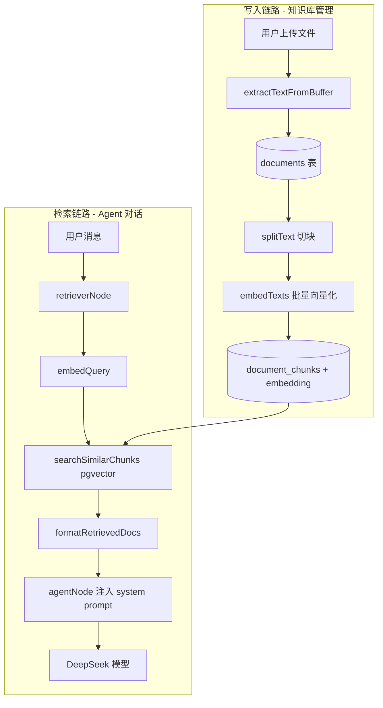

# RAG 知识库架构文档

本文档介绍项目中 RAG（Retrieval-Augmented Generation，检索增强生成）的实现方式、数据流与各模块的设计理由。

---

## 目录

1. [RAG 解决什么问题](#rag-解决什么问题)
2. [整体架构](#整体架构)
3. [写入链路（Indexing）](#写入链路indexing)
4. [检索链路（Retrieval）](#检索链路retrieval)
5. [各模块设计理由](#各模块设计理由)
6. [两套「知识检索」并存](#两套知识检索并存)
7. [数据模型](#数据模型)
8. [环境变量](#环境变量)
9. [当前局限与设计取舍](#当前局限与设计取舍)
10. [相关文件索引](#相关文件索引)

---

## RAG 解决什么问题

本项目是一个 **LangGraph Agent + 用户私有知识库** 的组合：用户上传文档，Agent 在对话时自动从知识库检索相关内容，注入 system prompt，让模型「有据可依」而非纯靠预训练知识。

核心思路：

1. **离线（Indexing）**：文档 → 切块 → 向量化 → 存入 pgvector
2. **在线（Retrieval）**：用户提问 → 问题向量化 → 相似度检索 → 片段注入 prompt → LLM 回答

---

## 整体架构



### 代码分层

| 层级 | 路径 | 职责 |
|------|------|------|
| RAG 核心 | `src/lib/rag/` | 切块、向量化、pgvector 检索 |
| 业务服务 | `src/services/knowledge-service.ts` | 文档 CRUD、ingest 编排 |
| Agent 集成 | `src/lib/agent/graph/` | LangGraph 节点，自动检索并注入上下文 |
| API / UI | `src/app/api/knowledge/`、`src/components/knowledge/` | 上传、列表、重试 ingest |

---

## 写入链路（Indexing）

### 1. 上传与解析

用户通过 `/api/knowledge/upload` 上传文件（最大 5MB），`knowledge-service` 调用 `extractTextFromBuffer` 提取纯文本，写入 `documents` 表，初始状态为 `pending`。

**支持的文件类型**：txt、md、json、csv 及 `text/*` MIME 类型。

**暂不支持 PDF**：刻意不引入额外解析依赖，降低复杂度。如需支持可接入 `pdf-parse` 等库。

### 2. Ingest：切块 → 向量化 → 入库

上传成功后立即触发 ingest（也可通过 `/api/knowledge/[id]/ingest` 手动重试）：

```
status → processing
  ↓
删除该文档所有旧 chunks（幂等重跑）
  ↓
splitText(doc.content)        → 文本切块
embedTexts(chunks)            → 批量向量化
  ↓
逐块写入 document_chunks
逐块 upsertChunkEmbedding     → 原生 SQL 写入 vector 列
  ↓
status → ready / failed
```

**为什么先删再建？** 支持重新 ingest，避免旧 chunk 残留。

**为什么 chunk 和 embedding 分两步写？** Prisma schema 未定义 `embedding` 字段（pgvector 的 `vector` 类型 Prisma 支持有限），向量通过原生 SQL 单独更新：

```sql
UPDATE document_chunks SET embedding = $1::vector WHERE id = $2
```

### 3. 切块策略

文件：`src/lib/rag/chunker.ts`

```typescript
const splitter = new RecursiveCharacterTextSplitter({
  chunkSize: 800,
  chunkOverlap: 120,
});
```

| 参数 | 值 | 原因 |
|------|-----|------|
| `chunkSize` | 800 字符 | 兼顾语义完整性和 embedding 窗口；太大检索粒度粗，太小上下文断裂 |
| `chunkOverlap` | 120 | 约 15% 重叠，减少句子/段落被截断在边界的问题 |
| 算法 | RecursiveCharacterTextSplitter | LangChain 标准方案，按段落 → 句子 → 字符递归切，比固定长度更自然 |

---

## 检索链路（Retrieval）

### 1. LangGraph 自动检索（非工具调用）

Agent 图结构（`src/lib/agent/graph/builder.ts`）：

```
START → retriever → agent → (tools 循环) → END
```

**为什么用独立 retriever 节点，而不是让 LLM 自己调工具？**

- **确定性**：每条用户消息都会检索，不依赖模型是否「想起来」要查知识库
- **低延迟**：检索在 LLM 推理之前完成，上下文一次注入
- **简单**：不需要多轮 tool call 才能拿到背景知识

`retrieverNode` 取**最后一条 HumanMessage** 作为 query，调用 `retrieveContext(userId, query)`，结果写入 graph state 的 `retrievedDocs` 字段。

### 2. 向量检索实现

文件：`src/lib/rag/retriever.ts`

```typescript
const queryEmbedding = await embedQuery(query);
const results = await searchSimilarChunks(userId, queryEmbedding, limit = 5);
return results.filter((r) => r.similarity >= 0.35);  // SIMILARITY_THRESHOLD
```

SQL 侧（`src/lib/rag/pgvector.ts`）使用余弦距离 + 用户隔离：

```sql
SELECT
  dc.id, dc.content, dc.chunk_index, d.filename,
  1 - (dc.embedding <=> $1::vector) AS similarity
FROM document_chunks dc
JOIN documents d ON d.id = dc.document_id
WHERE d.user_id = $2
  AND d.status = 'ready'
  AND dc.embedding IS NOT NULL
ORDER BY dc.embedding <=> $1::vector
LIMIT $3
```

| 设计点 | 说明 |
|--------|------|
| `<=>` 余弦距离 | embedding 检索的标准度量 |
| `user_id` 过滤 | 多租户隔离，用户 A 查不到用户 B 的文档 |
| `status = 'ready'` | 只检索 ingest 成功的文档 |
| `SIMILARITY_THRESHOLD = 0.35` | 过滤弱相关片段，减少噪声污染 prompt |
| catch 返回 `[]` | embedding API 或 DB 异常时不阻断对话 |

### 3. 注入 System Prompt

`agentNode` 调用 `formatRetrievedDocs(state.retrievedDocs)`，将检索结果追加到 system prompt 的「知识库上下文」章节：

```
以下是从用户知识库检索到的相关内容，请优先基于这些信息回答。如信息不足请说明。

[1] 来源: xxx.md (片段 #2, 相关度 78%)
<chunk content>

---

[2] 来源: yyy.txt (片段 #1, 相关度 65%)
<chunk content>
```

格式化时带上**来源文件名、片段序号、相关度**，方便模型引用并说明依据。

---

## 各模块设计理由

### Embedding：`OpenAIEmbeddings` + 可配置 API

文件：`src/lib/rag/embeddings.ts`

```typescript
new OpenAIEmbeddings({
  model: process.env.EMBEDDING_MODEL ?? "text-embedding-3-small",
  apiKey: process.env.EMBEDDING_API_KEY ?? process.env.DEEPSEEK_API_KEY,
  dimensions: EMBEDDING_DIMENSIONS,  // 默认 1536
  configuration: { baseURL: process.env.EMBEDDING_BASE_URL ?? "https://api.openai.com/v1" },
});
```

- **OpenAI 兼容接口**：同一套代码可接 OpenAI、DeepSeek 等 provider
- **`text-embedding-3-small`**：性价比高，1536 维对中小知识库足够
- **`embedQuery` / `embedDocuments` 分开**：部分模型对 query 和 document 有不同处理，是常见最佳实践

### 向量库：PostgreSQL + pgvector

文件：`src/lib/rag/pgvector.ts`

启动时懒初始化：

```sql
CREATE EXTENSION IF NOT EXISTS vector;
ALTER TABLE document_chunks ADD COLUMN IF NOT EXISTS embedding vector(1536);
CREATE INDEX IF NOT EXISTS document_chunks_embedding_idx
  ON document_chunks USING hnsw (embedding vector_cosine_ops);
```

**为什么不用 Pinecone / Qdrant / Milvus？**

- 项目已有 PostgreSQL（Prisma），**不增加运维组件**
- 文档量偏中小规模时，pgvector + HNSW 足够
- 关系数据（user、document）和向量在同一库，**事务、JOIN、权限过滤**都简单

HNSW 索引用于加速近似最近邻搜索。索引创建失败会被吞掉（部分环境不支持），不阻断主流程。

### 文档状态机

```
pending → processing → ready
                    ↘ failed
```

便于 UI 展示进度，也避免检索到半成品数据（只查 `status = 'ready'`）。

### 上传即 Ingest

用户上传后立刻索引，体验简单；ingest 失败时仍保留文档记录，可通过 UI 或 API 手动重试。

---

## 两套「知识检索」并存

项目中存在 **两条检索路径**，容易混淆：

| | 真实 RAG（用户知识库） | `retrieve_docs` 工具 |
|--|------------------------|----------------------|
| 触发方式 | 每条消息自动（retrieverNode） | LLM 主动调用 |
| 数据源 | 用户上传的 `document_chunks` | 硬编码 Mock 文档 |
| 算法 | 向量相似度 | 关键词匹配 |
| 文件 | `src/lib/rag/retriever.ts` | `src/lib/agent/tools/docs.ts` |

`retrieve_docs` 是早期 demo 用的模拟检索，**与用户知识库没有打通**。

真正起作用的是 **retrieverNode + pgvector** 这条链路。System prompt 中仍提到「回答政策类问题前先使用 retrieve_docs」，与自动 RAG 存在重复；实际对话时，用户上传的知识会通过 retriever 自动注入。

> **后续改进方向**：将 `retrieve_docs` 改为调用真实 `retrieveContext`，或从工具列表中移除。

---

## 数据模型

文件：`prisma/schema.prisma`

```prisma
model Document {
  id           String   @id @default(uuid())
  userId       String
  filename     String
  mimeType     String
  size         Int
  content      String?  @db.Text   // 原始全文，方便 re-ingest
  status       String   @default("pending")
  errorMessage String?
  chunkCount   Int      @default(0)
  chunks       DocumentChunk[]
}

model DocumentChunk {
  id         String @id @default(uuid())
  documentId String
  content    String @db.Text
  chunkIndex Int
  tokenCount Int?   // 粗估 length/4，目前未用于检索逻辑
  // embedding 不在 Prisma 里，由 pgvector 运行时 ALTER TABLE 添加
}
```

---

## 环境变量

| 变量 | 默认值 | 说明 |
|------|--------|------|
| `DATABASE_URL` | — | PostgreSQL 连接串（必需，含 pgvector） |
| `EMBEDDING_API_KEY` | 回退 `DEEPSEEK_API_KEY` | Embedding API 密钥 |
| `EMBEDDING_BASE_URL` | `https://api.openai.com/v1` | OpenAI 兼容 API 地址 |
| `EMBEDDING_MODEL` | `text-embedding-3-small` | Embedding 模型名 |
| `EMBEDDING_DIMENSIONS` | `1536` | 向量维度，需与模型和 pgvector 列一致 |

---

## 当前局限与设计取舍

1. **不支持 PDF**：有意控制依赖，需要时可加 `pdf-parse` 等
2. **无混合检索**：纯向量，没有 BM25 + 向量 rerank
3. **Query = 最后一条用户消息**：多轮对话中没有 query rewrite，追问可能检索不准
4. **同步 ingest**：大文件会阻塞 upload API（`maxDuration = 120s`）
5. **embedding 逐块 UPDATE**：chunk 数量多时偏慢，可改批量 insert
6. **Mock 工具未迁移**：`retrieve_docs` 应逐步改为调用真实检索，或移除

---

## 相关文件索引

```
src/lib/rag/
├── chunker.ts      # 文本切块 + 文件类型解析
├── embeddings.ts   # OpenAI 兼容 Embedding 封装
├── pgvector.ts     # pgvector 初始化、写入、相似度搜索
└── retriever.ts    # 检索编排 + prompt 格式化

src/services/
└── knowledge-service.ts   # 文档 CRUD + ingest 流程

src/lib/agent/graph/
├── builder.ts      # LangGraph 图定义（retriever → agent → tools）
└── nodes.ts        # retrieverNode / agentNode

src/app/api/knowledge/
├── route.ts                    # GET 文档列表
├── upload/route.ts             # POST 上传 + 自动 ingest
└── [id]/
    ├── route.ts                # DELETE 文档
    └── ingest/route.ts         # POST 重新 ingest

src/components/knowledge/
└── knowledge-page.tsx          # 知识库管理 UI
```

---

## 一句话总结

项目 RAG 的核心设计是：**LangGraph 前置自动检索 + PostgreSQL pgvector 存向量 + LangChain 切块/Embedding**，把用户私有文档在每次对话前注入 system prompt，实现「有依据的回答」；选型上优先 **简单、少组件、与现有 DB 复用**，而非引入独立向量库或依赖 Agent 主动调检索工具。
